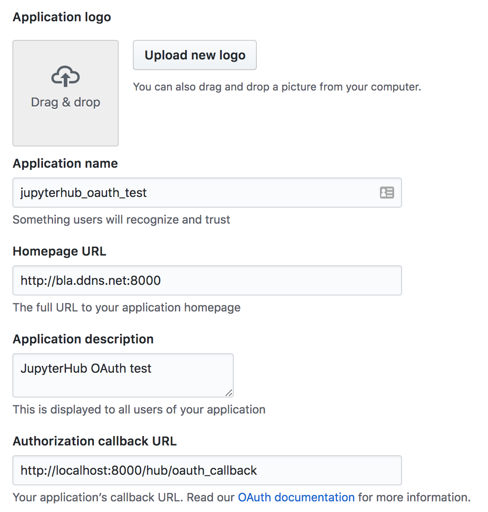

# JupyterHub - deauthorized


## Setup the container

### Building it

To build this (Docker) container just go for:

```bash
$ docker build -t myjupyterhub dockerfile/.
```

The image from `continuumio/miniconda3` is inherited, the
setup of JupyterHub and Notebook should be a smooth 5-minutes run.


### Running it

When you run the image (`myjupyterhub` in this case),
```bash
$ docker run --rm -it -p 8000:8000 myjupyterhub
```
, you'll then be sitting inside the container as `root` (default).


## Run the App

### Local (PAM) authentication

Run *JupyterHub* as:
```bash
$ jupyterhub
```

And it will start JupyterHub at por `8000` (default).
In our container we had created an user:
```
Username: user
Password: 123456
```

Which we will use to authenticate in the app, available at:
```
http://localhost:8000
```
A *login* screen should come to you, for `username` and `password`.

### OAuthentication

JupyterHub provides an interface to authenticate users through an external
OAuth authentication system.

## UltraAuth authentication

Run the container sharing the current working directory through `/work` inside the container:
```bash
$ docker run --rm -it -p 8000:8000 -v $PWD:/work myjupyterhub
$ cd /work
$ export ULTRAAUTH_CLIENT_ID='xxxxxxxxxxxxxxxxxxxx'
$ export ULTRAAUTH_CLIENT_SECRET='xxxxxxxxxxxxxxxxxxxxxxxxxxxxxxxxxxxxxxxx'
$ jupyterhub -f jupyterhub_config_ultraauth.py
```

## GitHub authentication

To authenticate using GitHub is a pretty straightforward process.
The file `jupyterhub_config_github.py` is set to authenticate using
GitHub OAuth interface.

Before running JupyterHub with the config, though, you have to create a OAuth App
in your GitHub's Developer settings.
In this step you'll need to give the App (this jupyterhub container) a name (any name you want),
a Homepage URL (I associated with my PC's dynamic DNS as from No-IP, but I don't really know
how important this is, also because in reality my port 8000 is blocked) and a
callback URL.

The figure below shows pretty much my setup.


After creating the App, the site will give you an `Client ID` and `Client Secret`,
those values we have to define as variables `GITHUB_CLIENT_ID` and `GITHUB_CLIENT_SECRET`
in our container's environment. Those variables will be read by our *config.py* when
we start the service.

### Run commands

To make it as clear as possible how we get our JupyterHub container running and
using the GitHub authentication system, let's review the commands.
It is supposed that the container (`./dockerfile/Dockerfile`) images is named `myjupyterhub`
and we are running it from inside this repository/directory.

Run the container sharing the current working directory through `/work` inside the container:
```bash
$ docker run --rm -it -p 8000:8000 -v $PWD:/work myjupyterhub
$ cd /work
$ export GITHUB_CLIENT_ID='xxxxxxxxxxxxxxxxxxxx'
$ export GITHUB_CLIENT_SECRET='xxxxxxxxxxxxxxxxxxxxxxxxxxxxxxxxxxxxxxxx'
$ jupyterhub -f jupyterhub_config_github.py
```

By now, JupyterHub should be running, accessible through URL `http://localhost:8000`
and ready to authenticate using GitHub.

/.\

## UltraAuth

To authenticate using the UltraAuth service we used OAuthenticator environment variables,
that is connect to a infinite redirection loop which we got in.

Those are the variable we defined:
```
export OAUTH2_AUTHORIZE_URL="https://srv.qryp.to/op/auth?scope=openid email address profile"
export OAUTH2_TOKEN_URL='https://srv.qryp.to/op/token'
export OAUTH2_USERDATA_URL='https://srv.qryp.to/op/me'
export OAUTH_CLIENT_ID='xxxxxxxxxxxxxxxxxxxxxxxxxxxxxxxxxxxx'
export OAUTH_CLIENT_SECRET='xxxxxxxxxxxxxxxxxxxxxxxxxxxxxxxxxxxxxxxxxxxxxxxxxxxxxxxxxxxxxxx'
export OAUTH_CALLBACK_URL='https://jupyterhub.example.com/hub/oauth_callback'
```

The values for `token`, `authorize` and `userdata` URLs, as well as available
auth types are provided by UltraAuth itself, from inside the user space.
